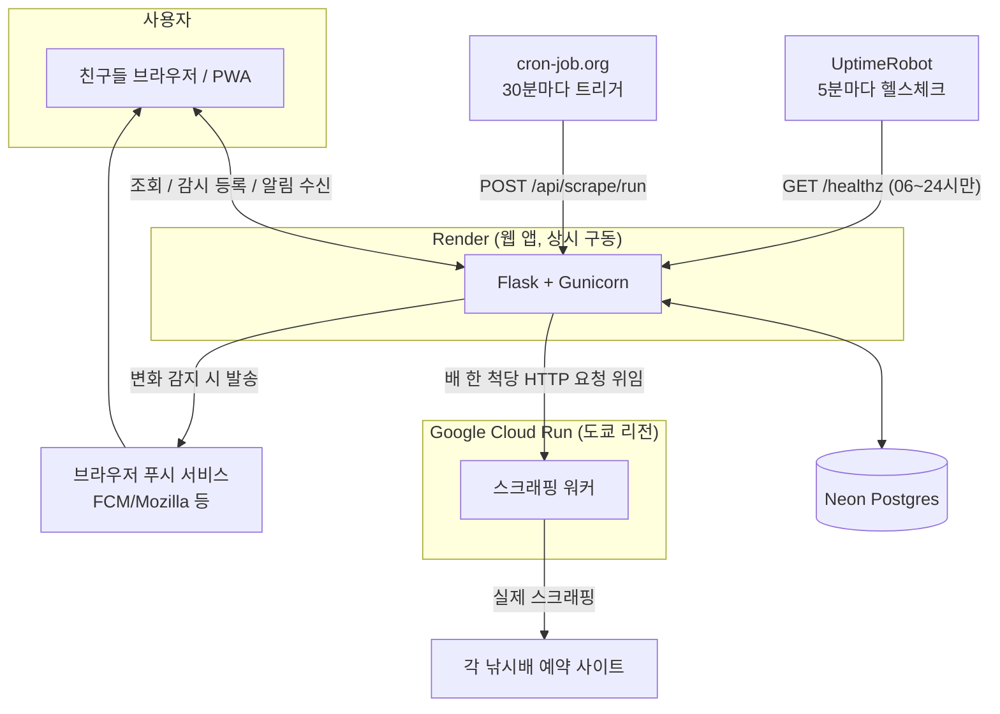

# AFT — 낚시배 자리 있냐?

선상낚시 예약 사이트를 대신 확인해서, 감시 중인 배에 빈자리가 나면 웹 푸시로 바로 알려주는 개인용 서비스입니다. 친구 몇 명이 같이 쓰는 규모(5명 이하)를 전제로, 전부 무료 티어 인프라 위에서 돌아갑니다.

- **운영 사이트**: https://aft-hcwf.onrender.com
- **화면**: 배 목록 · 예약현황(날짜별 전체 배 조회) · 빈자리 알림(감시 등록/체크 기록)

---

## 1. 이 프로젝트가 하는 일

1. 등록해둔 낚시배들의 예약 사이트를 주기적으로 대신 스크래핑한다.
2. 이전에 확인했던 상태와 비교해서 "마감 → 빈자리 남" 같은 변화가 생겼는지 판정한다.
3. 그 배·날짜를 감시 중인 사람에게 브라우저 웹 푸시로 알린다(자리 열림, 이후 최대 2번 반복 확인 알림).
4. 사람이 직접 들어와서 조회할 때는 실시간으로 71척 이상을 동시에 긁어와 보여준다(캐시가 있으면 캐시 우선).

로그인 없이, 브라우저 푸시 구독(+ 사용자가 정하는 알림 이름)만으로 사람을 구분합니다.

---

## 2. 기술 스택

| 영역 | 사용 기술 |
|---|---|
| 백엔드 | Python 3.12, Flask, Flask-SQLAlchemy, Flask-WTF |
| DB | PostgreSQL ([Neon](https://neon.tech) 관리형, 로컬 개발은 SQLite) |
| 프론트엔드 | 서버 렌더링 Jinja2 템플릿 + 바닐라 JS (별도 SPA 프레임워크 없음), PWA(Web App Manifest + Service Worker) |
| 알림 | Web Push(VAPID, `pywebpush`) |
| 스크래핑 | `requests` + `BeautifulSoup`(`lxml` 파서) |
| 웹서버 | Gunicorn |
| 테스트 | pytest (400개 이상, 실제 사이트 응답을 저장해둔 fixture 기반 회귀 테스트 포함) |

프론트는 React/Vue 같은 SPA가 아니라 "Flask가 완성된 HTML을 내려주고, 그 위에 바닐라 JS로 fetch 기반 상호작용을 얹는" 전통적인 서버 렌더링 구조입니다. 화면이 몇 개 안 되고 팀이 사실상 1인 규모라, 빌드 파이프라인이 필요한 프레임워크보다 이 편이 훨씬 단순합니다.

---

## 3. 인프라 구성 — 왜 서비스가 세 군데에 나뉘어 있나



### Render — 항상 켜져 있는 웹 앱
Flask 앱 자체(화면 렌더링, API, DB 접근)가 여기서 돕니다. 무료 티어라 15분 무활동 시 잠드는데, UptimeRobot이 낮 시간대(06~24시)에 5분 간격으로 `/healthz`를 찔러 깨어있게 유지합니다(24시간 내내 깨우면 월 750시간 무료 한도를 넘길 수 있어 일부러 밤엔 재웁니다).

### Neon — 관리형 Postgres
배 목록, 감시 등록, 알림 발송 이력, 스냅샷(마지막으로 확인한 배별 상태) 등 모든 영구 데이터가 여기 있습니다. 로컬 개발 시엔 `DATABASE_URL`이 없으면 자동으로 로컬 SQLite로 대체됩니다.

### GCP Cloud Run — 스크래핑 전용 워커
실제 낚시배 사이트에 접속해서 긁어오는 일은 Render가 아니라 별도의 Cloud Run 서비스(도쿄 리전)가 담당합니다. Render(미국계 클라우드)에서 한국 중소 호스팅 사이트로 접속하면 방화벽에 막혀 타임아웃이 나는 경우가 실측으로 확인돼서, 물리적으로 더 가까운 리전에 별도 워커를 두고 Render가 그 워커에 "이 배 좀 대신 확인해줘"라고 HTTP로 위임하는 구조로 바꿨습니다. 트래픽이 간헐적이라 Google Cloud의 상시 무료 한도(월 200만 요청 등) 안에서 사실상 무료로 운영됩니다.

### cron-job.org — 수집 트리거
30분마다 Render의 `/api/scrape/run`을 호출해서 "감시 등록된 배·날짜만" 수집하게 만듭니다. 원래는 GitHub Actions의 예약 실행(`schedule`)을 썼는데, 실제 실행 간격이 몇 시간씩 들쭉날쭉해서(실측으로 확인) 더 안정적인 외부 cron 서비스로 옮겼습니다.

### Web Push — 알림 채널
텔레그램 등은 검토만 하고 채택하지 않았고, 브라우저 표준 Web Push(VAPID) 하나로 충분하다고 판단해 그것만 씁니다. 텔레그램 봇 서버를 별도로 운영/관리할 필요가 없다는 게 이 규모(친구 5명)에는 더 맞았습니다.

---

## 4. CI/CD — 정확히는 "CI는 없고, CD만 있습니다"

- **CD(배포)**: `main` 브랜치에 push하면 Render가 자동으로 감지해서 다시 빌드·배포합니다(Git 연동, 별도 배포 스크립트 없음). Cloud Run 워커도 GitHub 연동 + Dockerfile 방식으로 같은 방식으로 자동 배포됩니다.
- **CI(자동 테스트)**: GitHub Actions 같은 자동 파이프라인은 **의도적으로 두지 않았습니다.** 이 저장소에 `.github/workflows`가 비어 있는 게 그 증거입니다 — 예전엔 수집 트리거용 워크플로(`scrape.yml`)가 있었지만, 실행 스케줄이 못 미더워서(위 cron-job.org 항목 참고) 아예 지웠습니다.
- 대신 사람(과 이 프로젝트를 돕는 Claude Code)이 **커밋 직전에 로컬에서 `pytest` 전체 스위트를 돌려 초록불을 확인하고 나서만 push**하는 규칙으로 대체합니다. 팀이 사실상 1인이라 PR 리뷰 절차 대신 이 방식이 실질적으로 더 빠르고, "테스트 그린 = 배포해도 됨"이라는 판단을 사람이 직접 매번 확인합니다.
- 파서(스크래핑 로직)를 고칠 땐 실제 사이트 응답을 저장해둔 스냅샷(fixture)과 정답(golden) 파일을 먼저 만들고 나서만 코드를 바꾸는 규칙이 있습니다 — 사이트 구조가 조금만 바뀌어도 파싱이 깨지는 게 이런 스크래퍼의 흔한 사고라, 실제 응답 없이 "이론상 맞는" 코드로 고치는 걸 금지합니다.

---

## 5. 로컬 개발

```bash
pip install -r requirements.txt

# 테스트
pytest

# 로컬 서버 (DATABASE_URL 없으면 SQLite로 자동 대체)
FLASK_APP=wsgi.py PYTHONPATH=src python -m flask run
```

필요한 환경변수(전부 선택 — 없어도 앱은 뜨고, 해당 기능만 비활성화됨):

| 변수 | 용도 |
|---|---|
| `DATABASE_URL` | Postgres 연결 문자열 (없으면 로컬 SQLite) |
| `VAPID_PUBLIC_KEY` / `VAPID_PRIVATE_KEY` / `VAPID_SUBJECT` | 웹 푸시 서명 키 |
| `KHOA_FISHING_API_KEY` | 국립해양조사원 바다낚시지수 API |
| `SCRAPE_TOKEN` | `/api/scrape/run` 호출 인증 (cron-job.org가 헤더로 전달) |
| `SCRAPE_WORKER_URL` / `SCRAPE_WORKER_TOKEN` | 설정 시 스크래핑을 Cloud Run 워커에 위임, 비어 있으면 로컬(Render)에서 직접 긁음 |

---

## 6. 디렉터리 구조 (뼈대만)

```
src/
  app.py                 앱 팩토리, 시작 시 DB 컬럼 보정
  routes/                뷰(화면 렌더링) + 감시 등록 API
  services/
    reservation_checker.py   예약 사이트 파서 (fetch+parse)
    tide/                    조석/물때 계산
    notify/                  웹 푸시 발송
    watch_service.py         감시 등록/해제
  scheduler/run_scrape.py     수집→비교→알림 파이프라인 본체
  templates/               Jinja2 화면
worker/                    Cloud Run 스크래핑 워커(위 reservation_checker.py의 실행용 사본)
tests/                     pytest (fixture 기반 회귀 테스트 포함)
```

---

## 7. 라이선스

개인 프로젝트입니다. 별도 라이선스 없이 비공개 용도로 운영 중입니다.
